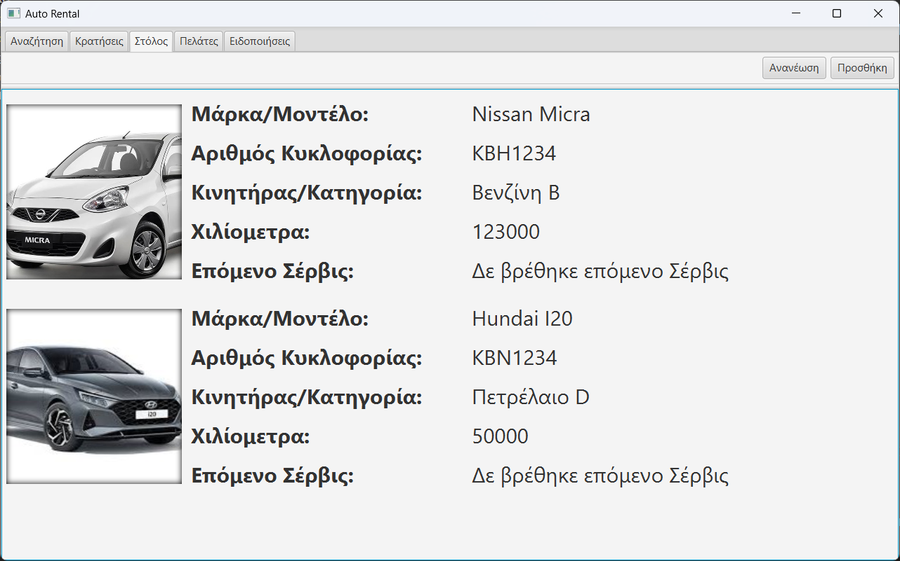

# Car Rental Management System

## Overview

The **Car Rental Management System** is a JavaFX application designed to streamline the process of managing a car rental business. This application allows users to manage reservations, car services, notifications for upcoming reservations and services, and keep track of customer information. Additionally, it provides the functionality to find all available cars for a given time period.

## Features

### Reservations Management

- **Create and manage reservations**: Easily add, update, and delete reservations.
- **View upcoming reservations**: See a list of all upcoming reservations.

### Car Services Management

- **Schedule car services**: Schedule maintenance and other services for cars.
- **View service history**: Track the service history of each car.
- **Service notifications**: Receive notifications for upcoming services.

### Notifications

- **Upcoming reservations**: Get notified of upcoming reservations to ensure cars are ready.
- **Service reminders**: Receive reminders for scheduled car services.

### Customer Management

- **Store customer information**: Keep track of customer details such as name and contact information.

### Availability Search

- **Find available cars**: Search for all available cars within a specified time period to quickly find options for new reservations.
